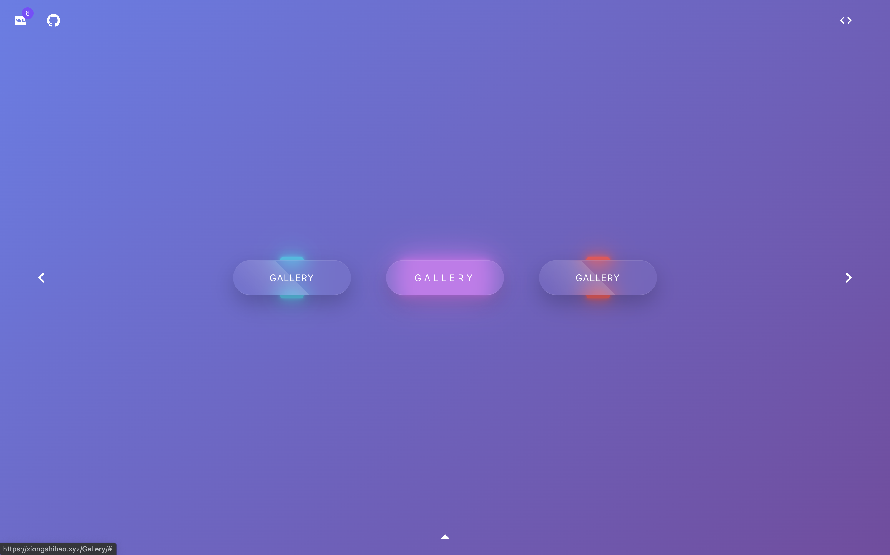
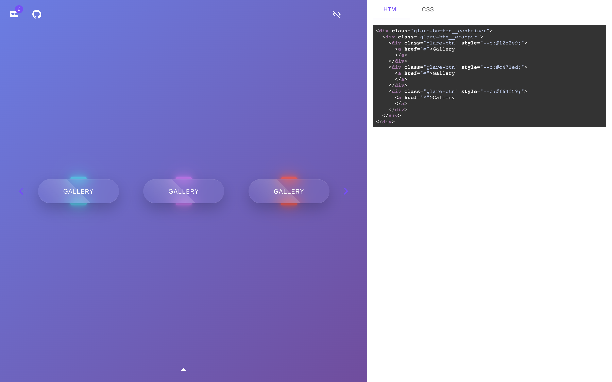

  

<h1 align="center"><a href="https://xiongshihao.xyz/Gallery/#/">Gallery</a></h1>

A Collection for Interactive Components

## Features
* Based on `Html5` and `Css3`, can be used in anywhere
* Highly interactive
* Get the code directly and use it

## How to Use
Just three steps
1. Chooes the one of the components you like

2. Open the code panel

3. Then, copy the code and enjoy it and you got the wonderful component

## Get Start

  👉 <a href="https://xiongshihao.xyz/Gallery/#/">Just click me</a> 👈

